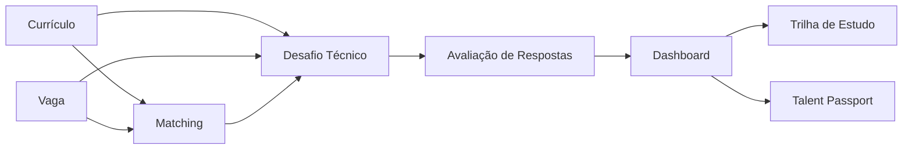

# KANdo — Talent Passport

[](LICENSE)

> Plataforma de preparação para processos seletivos em tecnologia: o candidato sobe currículo e vaga, recebe um score de compatibilidade, faz um simulado técnico personalizado e sai com uma trilha de estudo personalizada e um perfil consolidado (Talent Passport).


## 👥 Equipe

| Nome | Papel | GitHub | LinkedIn |
|------|-------|--------|----------|
| Nícolas (Líder) | Frontend | [](https://github.com/NicolasSG) | [](https://www.linkedin.com/in/nicolas-sg-br/) |
| Karina | Backend | [](https://github.com/KarinaS0uza) | [](https://www.linkedin.com/in/kar1na-souza/) |
| Andreia | IA(documentação técnica) | [](https://github.com/Deialima) | [](https://www.linkedin.com/in/andreia-lima-4a8747168) |

## 🔗 Links rápidos

| Recurso | Link |
|---|---|
| 🌐 Produto no ar | [kando-eta.vercel.app](https://kando-eta.vercel.app/) |
| 📋 Pesquisa de mercado | [Dashboard da pesquisa](https://deialima.github.io/kando/Pesquisa%20de%20mercado.html) |
| 💻 Documentação do frontend | [docs/frontend.md](docs/frontend.md) |
| ⚙️ Documentação do backend | [docs/backend.md](docs/backend.md) |
| 🤖 Documentação da IA | [docs/ai.md](docs/ai.md) |

## 📑 Sumário

- [Equipe](#-equipe)
- [O problema](#-o-problema)
- [A solução](#-a-solução)
- [Funcionalidades](#-funcionalidades)
- [Arquitetura](#arquitetura)
- [Tecnologias](#tecnologias)
- [Como rodar localmente](#como-rodar-localmente)
- [Nota de esclarecimento](#-nota-de-esclarecimento)
- [Status do projeto](#-status-do-projeto)
- [Licença](#-licença)

## 🎯 O problema

Candidatos de tecnologia costumam chegar em processos seletivos sem saber
exatamente onde estão fracos em relação aos requisitos reais da vaga
específica que estão disputando. "Estudar tudo" não é viável no pouco tempo
que normalmente existe entre a candidatura e a entrevista.

## 💡 A solução

O candidato sobe o próprio currículo e a vaga desejada, ao mesmo tempo. A
plataforma extrai e estrutura os dois documentos com IA, Entrega um score de
compatibilidade e as lacunas de skill, gera um desafio técnico personalizado
pra esse par currículo-vaga, avalia as respostas por skills, e devolve um
plano de estudo priorizado pelas lacunas reais encontradas — tudo isso sem
nenhum recrutador alimentando a plataforma.


> Veja o produto no ar em
> [kando-eta.vercel.app](https://kando-eta.vercel.app/).*

## ✨ Funcionalidades

- [x] Normalização automática de currículo, com extração de skills, experiências e senioridade calculada
- [x] Normalização automática de vaga, requisitos e tecnologias
- [x] Matching currículo × vaga, com score de compatibilidade, skills compatíveis e lacunas
- [x] Geração de simulado técnico personalizado com perguntas conceituais
- [x] Avaliação de respostas com feedback e desempenho por skill
- [x] Dashboard com score geral e desempenho técnico consolidado
- [x] Geração de Talent Passport com perfil profissional e recomendações
- [x] Geração de trilha de estudo personalizada a partir de lacunas e desempenho
- [x] Principais telas conectadas à API: upload, matching, dashboard, simulado, trilha e Passport
- [x] Importação de currículos e vagas em PDF, com tratamento de falhas de conversão
- [x] Tratamento de erros de IA: prompt ausente, JSON inválido, limite de uso e erros de configuração
- [x] Validação end-to-end contra a API real do Groq
- [x] Deploy Concluido

## Arquitetura

Visão geral do fluxo:



Para detalhes de implementação de cada parte, veja as docs específicas linkadas acima.

## Tecnologias

| Camada | Stack |
|---|---|
| **Frontend** |        |
| **Backend** |    |
| **Banco** |   |
| **IA** |    |
| **PDFs** |   |
| **Autenticação** |  |
| **Deploy** |   |

## Como rodar localmente

### Pré-requisitos

- Python 3.11+
- Node.js 20+
- Uma chave de API da [Groq](https://groq.com/)

### Backend

```bash
cd backend
python -m venv .venv
# Ative o ambiente virtual conforme seu sistema
pip install -r requirements.txt
```

Crie `backend/.env`:

```env
DJANGO_SECRET_KEY=uma_chave_secreta_segura
DJANGO_DEBUG=True
DJANGO_ALLOWED_HOSTS=localhost,127.0.0.1

# IA: uma chave ou uma lista de chaves separadas por vírgula
GROQ_API_KEY=sua_chave_aqui
# GROQ_API_KEYS=chave_1,chave_2
GROQ_MODEL=openai/gpt-oss-120b

# Banco local (padrão)
DATABASE_ENGINE=sqlite

# Frontend local
DJANGO_CORS_ALLOWED_ORIGINS=http://localhost:5173

# Opcional: PostgreSQL/Supabase
# DATABASE_ENGINE=supabase
# DB_NAME=...
# DB_USER=...
# DB_PASSWORD=...
# DB_HOST=...
# DB_PORT=5432
```

```bash
python manage.py migrate
python manage.py runserver
```

> Para as etapas de IA funcionarem, os prompts necessários precisam estar ativos no banco. Sem um prompt ativo, a API devolve um erro controlado para a etapa correspondente.

A API ficará disponível em `http://localhost:8000/api` e o health check em
`http://localhost:8000/health/`.

### Frontend

```bash
cd frontend
npm install
npm run dev
```

Crie `frontend/.env`:

```env
VITE_API_URL=http://localhost:8000/api
```

O frontend consome a URL definida em `VITE_API_URL`. Para produção, defina essa
variável com a URL pública da API seguida de `/api`.

Detalhes completos em [docs/frontend.md](docs/frontend.md),
[docs/backend.md](docs/backend.md) e [docs/ai.md](docs/ai.md).

## 📝 Nota de esclarecimento

> **Nota de esclarecimento — histórico da escolha de modelo:** durante a fase de testes, a equipe avaliou
> múltiplos modelos servidos pela Groq (incluindo Llama, GPT e Qwen) ao longo de
> aproximadamente uma semana. O Llama apresentou os resultados mais consistentes nos
> testes locais e foi a escolha inicial para produção. Dois dias antes da entrega do
> projeto, a Groq comunicou por e-mail a descontinuação do modelo Llama utilizado,
> exigindo a migração para o segundo modelo com melhor desempenho nos testes
> (`openai/gpt-oss-120b`) em um prazo de 24 horas. Essa migração emergencial explica
> as trocas de modelo visíveis no histórico de commits (qwen → gpt → qwen → gpt) e
> reforça a recomendação acima de sempre conferir `ai_core/llm.py` e a variável
> `GROQ_MODEL` efetivamente configurada em produção, em vez de assumir que o modelo
> documentado aqui é definitivo — dado o precedente de descontinuações por parte do
> provedor com pouco aviso prévio.


## 📅 Status do projeto

Construído para o Hackathon Juninhos-Nortjobs, entre 16/07/2026 e 16/08/2026.

- [x] Fluxo principal implementado: currículo e vaga → matching → simulado → avaliação → dashboard → trilha → Talent Passport
- [x] Autenticação JWT, persistência e isolamento dos dados por usuário
- [x] Upload por texto ou PDF, com validação e tratamento de falhas
- [x] Tratamento de erros de IA e persistência de resultados com falha controlada
- [x] Frontend conectado aos principais endpoints da API
- [x] Validação end-to-end com a API real do Groq
- [x] Configuração e validação final de deploy

## 🤖 Disclaimer sobre uso de IA no desenvolvimento

Durante o desenvolvimento deste projeto, a equipe utilizou o Claude Sonnet 5 (Anthropic)
como ferramenta de apoio e tutoria técnica — auxiliando em dúvidas de implementação,
revisão de lógica e boas práticas ao longo do processo. As decisões de arquitetura,
implementação e integração final foram de responsabilidade da equipe.


## 📄 Licença

Este projeto está licenciado sob a [MIT License](LICENSE) — você pode usar, copiar, modificar e distribuir livremente, inclusive para fins comerciais, desde que mantenha o aviso de copyright original.
